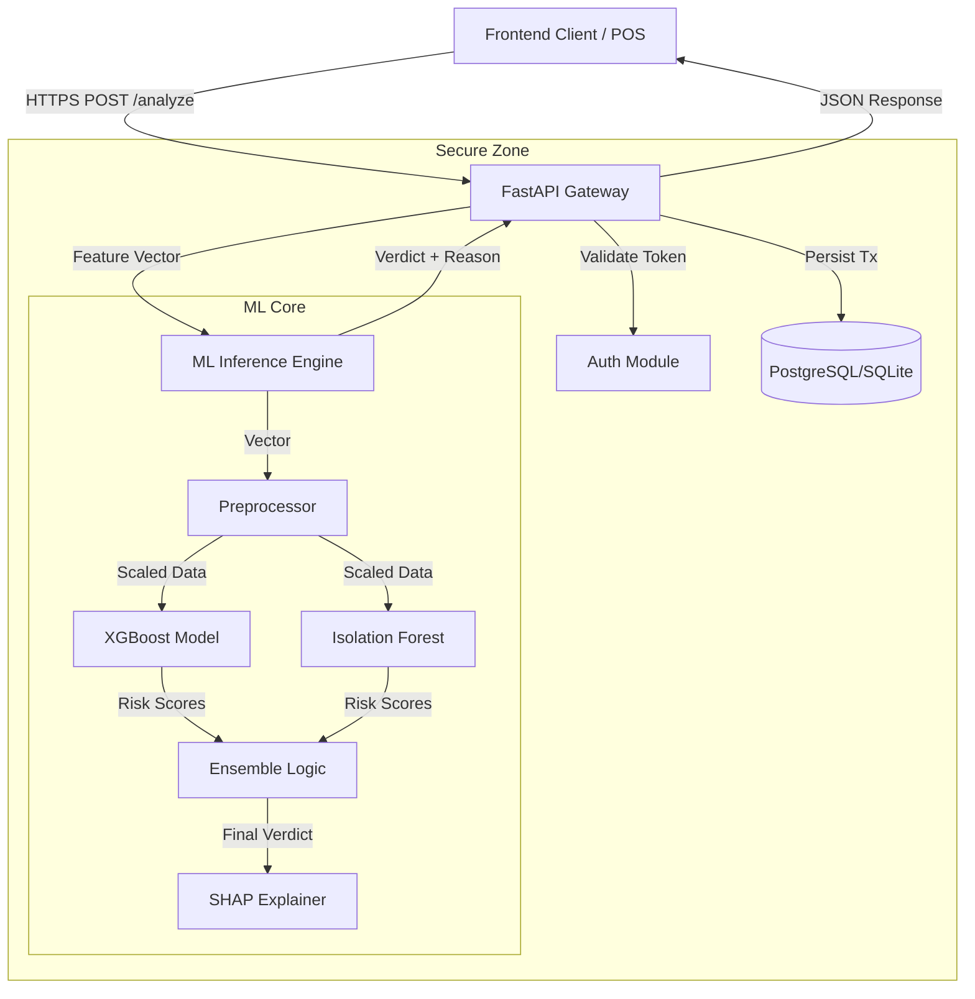

# AegisFlow: A Next-Gen Fraud Detection & Prevention Engine


> **Enterprise-Grade Financial Intelligence System** leveraging hybrid Machine Learning (XGBoost + Isolation Forest) to detect fraudulent anomalies in real-time (<200ms) with Explainable AI transparency.

---

## Table of Contents
- [Overview](#overview)
- [Features](#features)
- [Architecture](#architecture)
- [Tech Stack](#tech-stack)
- [Prerequisites](#prerequisites)
- [Quick Start](#quick-start)
- [Project Structure](#project-structure)
- [API Endpoints](#api-endpoints)
- [Security](#security)
- [Configuration](#configuration)
- [Development](#development)
- [Testing](#testing)
- [Deployment](#deployment)
- [Contributing](#contributing)
- [License](#license)

---

## Overview

**AegisFlow** is a high-latency, mission-critical financial security infrastructure designed to mirror the operational rigor of Tier-1 banking systems. Unlike static notebooks or academic classifiers, AegisFlow is an **active defense layer** that ingests raw transaction streams, extracts features dynamically, and enforces decision boundaries using a weighted ensemble of supervised and unsupervised models.

The system solves the "Black Box" problem in AI by integrating **SHAP (Shapley Additive Explanations)**, providing granular "Why" factors for every block decision. This empowers potential compliance audits and helps analysts understand the root cause of flagged transactions.

## Features

- **Real-Time Analysis**: Processes transactions in <200ms (P95 latency).
- **Hybrid Scoring Engine**: Combines **XGBoost** (for known fraud patterns) and **Isolation Forest** (for zero-day anomalies).
- **Explainable AI (XAI)**: Returns top 3 contributing factors for every risk score (e.g., "High amount relative to user history").
- **Live Dashboard**: React-based command center for monitoring global transaction flows.
- **Geospatial Tracking**: Visualizes threat origins on an interactive world map.
- **Role-Based Access**: Secure JWT authentication with RBAC (Admin/Analyst).
- **Audit Logging**: Full persistence of all analyzed transactions for historical review.

---

## Architecture

AegisFlow follows an Event-Driven Microservices pattern (conceptually), optimized for speed and reliability.



## Tech Stack

| Component | Technology | Rationale |
| :--- | :--- | :--- |
| **Backend** | **FastAPI** (Python 3.11) | High-performance Async I/O, native Pydantic integration. |
| **Frontend** | **React** + **Vite** | Reactive UI updates, optimized build size. |
| **Styling** | **Tailwind CSS** + **ShadcnUI** | "Classmorphism" design system, rapid prototyping. |
| **ML Engine** | **XGBoost**, **Scikit-Learn** | Industry standard for tabular data classification. |
| **Explainability** | **SHAP** | Game-theoretic approach to model interpretability. |
| **Database** | **SQLite** (Dev) / **PostgreSQL** (Prod) | ACID compliance for financial ledgers. |
| **Containerization** | **Docker** (Optional) | Reproducible deployment environments. |

---

## Prerequisites

Before running the system, ensure you have the following installed:

*   **Python 3.10+**: [Download Python](https://www.python.org/downloads/)
*   **Node.js 18+ (LTS)**: [Download Node.js](https://nodejs.org/)
*   **Git**: Version control CLI.

---

## Quick Start

### 1. Clone the Repository
```bash
git clone https://github.com/AdityaPardikar/AegisFlow.git
cd AegisFlow
```

### 2. Backend Setup
```powershell
# Create virtual environment
python -m venv backend/venv
.\backend\venv\Scripts\activate

# Install dependencies
pip install -r backend/requirements.txt

# Hydrate Models (Train on Synthetic Data)
python backend/ml_engine/trainer.py

# Launch API Server
python -m uvicorn backend.app.main:app --reload --host 127.0.0.1 --port 8000
```

### 3. Frontend Setup
```bash
# Open a new terminal
cd frontend
npm install
npm run dev
```

**Access Points:**
- Dashboard: `http://localhost:8080`
- API Docs: `http://localhost:8000/docs`
- **Default Admin**: `admin@aegisflow.com` / `admin123`

---

## Project Structure

```text
AegisFlow/
├── backend/
│   ├── app/
│   │   ├── api/          # Route handlers (Auth, Analyze, Users)
│   │   ├── core/         # Config & Security (JWT, Hashing)
│   │   ├── models/       # SQLAlchemy ORM Models
│   │   └── schemas/      # Pydantic Schemas
│   ├── ml_engine/        # The AI Core
│   │   ├── trainer.py    # Training Pipeline
│   │   ├── predictor.py  # Inference & Logic
│   │   └── features.py   # Feature Engineering
│   └── tests/            # API Verification Scripts
├── frontend/
│   ├── src/
│   │   ├── components/   # UI Reusable Blocks
│   │   ├── pages/        # Dashboard Views (LiveMonitor, Settings)
│   │   └── lib/          # API Clients & Utilities
└── assets/               # Static resources
```

---

## API Endpoints

| Method | Endpoint | Description | Auth Required |
| :--- | :--- | :--- | :--- |
| `POST` | `/api/v1/login/access-token` | Authenticate & get JWT | No |
| `POST` | `/api/v1/analyze` | analyze a transaction for fraud | **Yes** |
| `GET` | `/api/v1/transactions` | Retrieve transaction history | **Yes** |
| `GET` | `/api/v1/users/me` | Get current user profile | **Yes** |
| `PUT` | `/api/v1/users/me` | Update user profile | **Yes** |

---

## Security

AegisFlow adopts a "Security-by-Design" approach:
1.  **Authentication**: OAuth2 Password Flow with Bearer Tokens.
2.  **Encryption**: User passwords hashed with Bcrypt (via Passlib).
3.  **Validation**: Strict input validation using Pydantic Types.
4.  **CORS**: Configured to allow only trusted frontend origins (default: localhost).

---

## Configuration

Environment variables can be set in a `.env` file in the `backend/` directory.

| Variable | Default | Description |
| :--- | :--- | :--- |
| `PROJECT_NAME` | AegisFlow | Application Name |
| `SECRET_KEY` | *(Generated)* | JWT Signing Key |
| `ACCESS_TOKEN_EXPIRE_MINUTES` | 30 | Session Duration |
| `DATABASE_URL` | `sqlite:///./fraud_detection.db` | DB Connection String |

---

## Development

To expand the ML capabilities:
1.  Modify `backend/ml_engine/trainer.py` to ingest real datasets (e.g., Kaggle Credit Card Fraud/Paysim).
2.  Adjust Feature Engineering in `backend/ml_engine/features.py`.
3.  Run `trainer.py` to regenerate `xgb_model.pkl` and `iso_forest.pkl`.
4.  Restart the backend to reload the new model artifacts.

---

## Testing

Run the included verification script to simulate a full transaction lifecycle:

```powershell
python tests/verify_api.py
```

This script will:
1.  Ping the Health Endpoint.
2.  Log in as Admin to get a Token.
3.  Submit a "Safe" transaction (Expect ALLOW).
4.  Submit a "Fraud" transaction (High Amount, Velocity > 5) (Expect DENY/REVIEW).
5.  Print the JSON explanations from the ML Engine.

---

## Deployment

### Docker (Recommended)
Build the container set:

```bash
docker-compose up --build -d
```
*Note: Ensure `Dockerfile` and `docker-compose.yml` are configured for your environment.*

### Manual Deployment
Use **Gunicorn** with Uvicorn workers for production limits:
```bash
gunicorn backend.app.main:app -w 4 -k uvicorn.workers.UvicornWorker
```

---

## Contributing

We welcome contributions! Please follow the standard Git flow:
1.  Fork the project.
2.  Create your feature branch: `git checkout -b feature/AmazingFeature`
3.  Commit your changes: `git commit -m 'Add some AmazingFeature'`
4.  Push to the branch: `git push origin feature/AmazingFeature`
5.  Open a Pull Request.

---

## License

Distributed under the MIT License. See `LICENSE` for more information.
