# 🛡️ AegisFlow: A Next-Gen Fraud Detection & Prevention Engine


> **🚀 Enterprise-Grade Financial Intelligence System** leveraging hybrid Machine Learning (**XGBoost** + **Isolation Forest**) to detect fraudulent anomalies in **real-time (<200ms)** with **Explainable AI** transparency.


---

## 📑 Table of Contents
- [🧐 Overview](#-overview)
- [✨ Features](#-features)
- [🏗️ Architecture](#️-architecture)
- [🛠️ Tech Stack](#️-tech-stack)
- [📋 Prerequisites](#-prerequisites)
- [🚀 Quick Start](#-quick-start)
- [📂 Project Structure](#-project-structure)
- [🔌 API Endpoints](#-api-endpoints)
- [🔐 Security](#-security)
- [⚙️ Configuration](#️-configuration)
- [💻 Development](#-development)
- [🧪 Testing](#-testing)
- [🚢 Deployment](#-deployment)
- [🤝 Contributing](#-contributing)
- [📜 License](#-license)

---

## 🧐 Overview

**AegisFlow** is a high-latency, mission-critical financial security infrastructure designed to mirror the operational rigor of Tier-1 banking systems. Unlike static notebooks or academic classifiers, AegisFlow is an **active defense layer** that ingests raw transaction streams, extracts features dynamically, and enforces decision boundaries using a weighted ensemble of supervised and unsupervised models.

The system solves the **"Black Box"** problem in AI by integrating **SHAP (Shapley Additive Explanations)**, providing granular "Why" factors for every block decision. This empowers potential compliance audits and helps analysts understand the root cause of flagged transactions.

---

## ✨ Features

| Feature | Description |
| :--- | :--- |
| **⚡ Real-Time Analysis** | Processes transactions in **<200ms** (P95 latency). |
| **🧠 Hybrid Scoring Engine** | Combines **XGBoost** (for known fraud patterns) and **Isolation Forest** (for zero-day anomalies). |
| **🔎 Explainable AI (XAI)** | Returns top 3 contributing factors for every risk score (e.g., *"High amount relative to user history"*). |
| **📊 Live Dashboard** | React-based command center for monitoring global transaction flows. |
| **🌍 Geospatial Tracking** | Visualizes threat origins on an interactive world map. |
| **🛡️ Role-Based Access** | Secure **JWT authentication** with RBAC (Admin/Analyst). |
| **💾 Audit Logging** | Full persistence of all analyzed transactions for historical review. |

---

## 🏗️ Architecture

AegisFlow follows an **Event-Driven Microservices** pattern (conceptually), optimized for speed and reliability.

```mermaid
graph TD
    Client[💻 Frontend Client / POS] -->|HTTPS POST /analyze| API[🚀 FastAPI Gateway]
    
    subgraph "🔒 Secure Zone"
        API -->|Validate Token| Auth[🔑 Auth Module]
        API -->|Persist Tx| DB[(🗄️ PostgreSQL/SQLite)]
        
        API -->|Feature Vector| MLEngine[🧠 ML Inference Engine]
        
        subgraph "🤖 ML Core"
            MLEngine -->|Vector| Pre[⚙️ Preprocessor]
            Pre -->|Scaled Data| XGB[🌲 XGBoost Model]
            Pre -->|Scaled Data| ISO[🌳 Isolation Forest]
            
            XGB & ISO -->|Risk Scores| Ensemble[⚖️ Ensemble Logic]
            Ensemble -->|Final Verdict| SHAP[💡 SHAP Explainer]
        end
        
        MLEngine -->|Verdict + Reason| API
    end
    
    API -->|JSON Response| Client
```



---

## 🛠️ Tech Stack

| Component | Technology | Rationale |
| :--- | :--- | :--- |
| **Backend** |  | High-performance Async I/O, native Pydantic integration. |
| **Frontend** |  | Reactive UI updates, optimized build size. |
| **Styling** |  | "Classmorphism" design system, rapid prototyping. |
| **ML Engine** |  | Industry standard for tabular data classification. |
| **Database** |  | ACID compliance for financial ledgers. |
| **Container** |  | Reproducible deployment environments. |

---

## 📋 Prerequisites

Before running the system, ensure you have the following installed:

*   🐍 **Python 3.10+**: [Download Python](https://www.python.org/downloads/)
*   📦 **Node.js 18+ (LTS)**: [Download Node.js](https://nodejs.org/)
*   📥 **Git**: Version control CLI.

---

## 🚀 Quick Start

### 1️⃣ Clone the Repository
```bash
git clone https://github.com/AdityaPardikar/AegisFlow.git
cd AegisFlow
```

### 2️⃣ Backend Setup
```powershell
# Create virtual environment
python -m venv backend/venv
.\backend\venv\Scripts\activate

# Install dependencies
pip install -r backend/requirements.txt

# Hydrate Models (Train on Synthetic Data)
python backend/ml_engine/trainer.py

# Launch API Server
python -m uvicorn backend.app.main:app --reload --host 127.0.0.1 --port 8000
```

### 3️⃣ Frontend Setup
```bash
# Open a new terminal
cd frontend
npm install
npm run dev
```

**🔑 Access Points:**
- **Dashboard**: `http://localhost:8080`
- **API Docs**: `http://localhost:8000/docs`
- **Default Admin**: `admin@aegisflow.com` / `admin123`

---

## 📂 Project Structure

```text
AegisFlow/
├── 🐍 backend/
│   ├── 📱 app/
│   │   ├── 🔌 api/          # Route handlers (Auth, Analyze, Users)
│   │   ├── 🔐 core/         # Config & Security (JWT, Hashing)
│   │   ├── 🗄️ models/       # SQLAlchemy ORM Models
│   │   └── 📝 schemas/      # Pydantic Schemas
│   ├── 🧠 ml_engine/        # The AI Core
│   │   ├── trainer.py       # Training Pipeline
│   │   ├── predictor.py     # Inference & Logic
│   │   └── features.py      # Feature Engineering
│   └── 🧪 tests/            # API Verification Scripts
├── ⚛️ frontend/
│   ├── 📁 src/
│   │   ├── 🧱 components/   # UI Reusable Blocks
│   │   ├── 📄 pages/        # Dashboard Views (LiveMonitor, Settings)
│   │   └── 🔧 lib/          # API Clients & Utilities
└── 🖼️ assets/               # Static resources
```

---

## 🔌 API Endpoints

| Method | Endpoint | Description | Auth Required |
| :--- | :--- | :--- | :--- |
| `POST` | `/api/v1/login/access-token` | Authenticate & get JWT | ❌ No |
| `POST` | `/api/v1/analyze` | analyze a transaction for fraud | ✅ **Yes** |
| `GET` | `/api/v1/transactions` | Retrieve transaction history | ✅ **Yes** |
| `GET` | `/api/v1/users/me` | Get current user profile | ✅ **Yes** |
| `PUT` | `/api/v1/users/me` | Update user profile | ✅ **Yes** |

---

## 🔐 Security

AegisFlow adopts a **"Security-by-Design"** approach:
1.  **Authentication**: OAuth2 Password Flow with Bearer Tokens.
2.  **Encryption**: User passwords hashed with Bcrypt (via Passlib).
3.  **Validation**: Strict input validation using Pydantic Types.
4.  **CORS**: Configured to allow only trusted frontend origins (default: localhost).

---

## ⚙️ Configuration

Environment variables can be set in a `.env` file in the `backend/` directory.

| Variable | Default | Description |
| :--- | :--- | :--- |
| `PROJECT_NAME` | AegisFlow | Application Name |
| `SECRET_KEY` | *(Generated)* | JWT Signing Key |
| `ACCESS_TOKEN_EXPIRE_MINUTES` | 30 | Session Duration |
| `DATABASE_URL` | `sqlite:///./fraud_detection.db` | DB Connection String |

---

## 💻 Development

To expand the ML capabilities:
1.  Modify `backend/ml_engine/trainer.py` to ingest real datasets (e.g., Kaggle Credit Card Fraud/Paysim).
2.  Adjust Feature Engineering in `backend/ml_engine/features.py`.
3.  Run `trainer.py` to regenerate `xgb_model.pkl` and `iso_forest.pkl`.
4.  Restart the backend to reload the new model artifacts.

---

## 🧪 Testing

Run the included verification script to simulate a full transaction lifecycle:

```powershell
python tests/verify_api.py
```

This script will:
1.  Ping the **Health Endpoint**.
2.  Log in as **Admin** to get a Token.
3.  Submit a **"Safe"** transaction (Expect ALLOW).
4.  Submit a **"Fraud"** transaction (High Amount, Velocity > 5) (Expect DENY/REVIEW).
5.  Print the JSON explanations from the ML Engine.

---

## 🚢 Deployment

### 🐳 Docker (Recommended)
Build the container set:

```bash
docker-compose up --build -d
```
*Note: Ensure `Dockerfile` and `docker-compose.yml` are configured for your environment.*

### 🛠️ Manual Deployment
Use **Gunicorn** with Uvicorn workers for production limits:
```bash
gunicorn backend.app.main:app -w 4 -k uvicorn.workers.UvicornWorker
```

---

## 🤝 Contributing

We welcome contributions! Please follow the standard Git flow:
1.  Fork the project.
2.  Create your feature branch: `git checkout -b feature/AmazingFeature`
3.  Commit your changes: `git commit -m 'Add some AmazingFeature'`
4.  Push to the branch: `git push origin feature/AmazingFeature`
5.  Open a Pull Request.

---

## 📜 License

Distributed under the **MIT License**. See `LICENSE` for more information.
